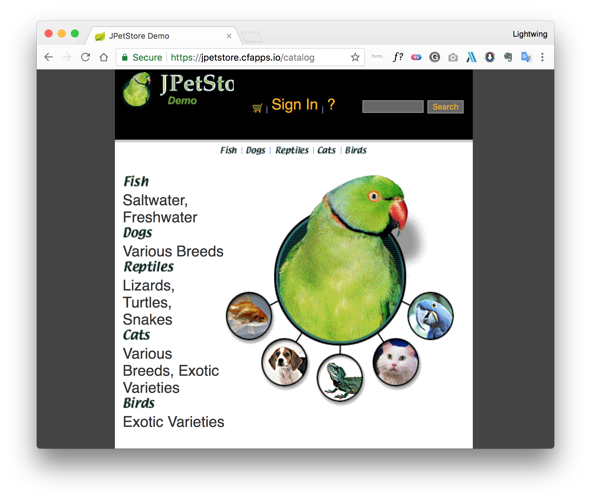
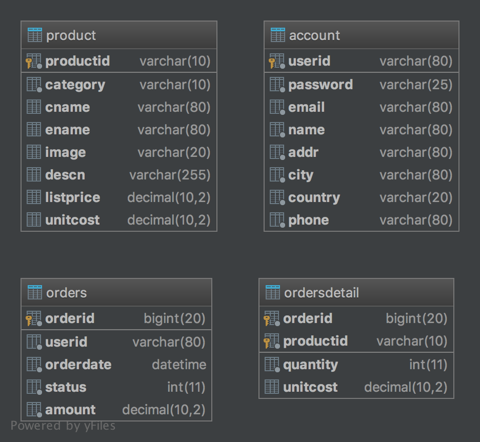
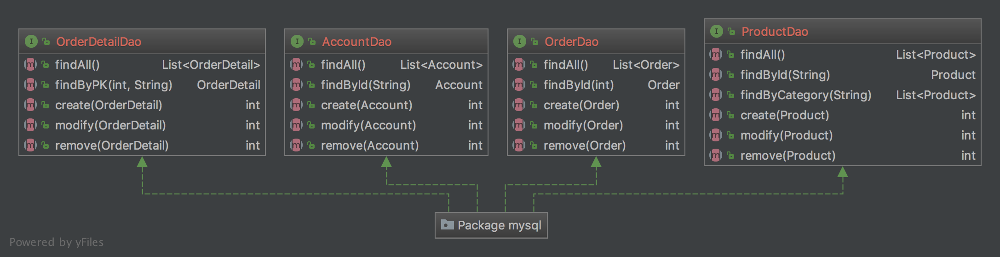

# Java_PetStore

# PetStore Demo 宠物商店项目

本章介绍 JavaSE 技术实现的 PetStore 宠物商店项目，所涉及的知识点：Java 面向对象、Lambda 
表达式、JavaSwing 技术、JDBC技术和数据库相关等知识，其中还会用到方方面面的 
Java 基础知识。

## 1 系统分析与设计

本节对 PetStore 宠物商店项目进行分析和设计，其中设计过程包括原型设计、数据库设计、架构设计和系统设计。

### 1.1 项目概述

PetStore 是 Sun（现在 Oracle）公司为了演示自己的 JavaEE 技术，而编写的一个基于 Web 宠物店项目，如图29-1所示为项目启动页面，项目介绍网站是 `http://www`
`.oracle.com/technetwork/java/index-136650.html`。PetStore 是典型的电子商务项目，是现在很多电商平台的雏形。技术方面主要是 JavaEE 技术，用户界面采用 JavaWeb 介绍实现。但本书介绍JavaSE 技术，不介绍 JavaWeb，所以本章的 PetStore 项目用户界面采用 JavaSwing 技术实现。



### 1.2 需求分析

PetStore 宠物商店项目主要功能如下：

- 用户登录
- 查询商品
- 添加商品到购物车
- 查看购物车
- 下订单
- 查看订单

采用用例分析方法描述用例图，如图1-2所示：


### 1.3 原型设计

原型设计草图对于开发人员、设计人员、测试人员、UI 设计人员以及用户都是非常重要的。PetStore 宠物商店项目原型设计图如图1-3所示。


### 1.4 数据库设计

Java 官方提供的 PetStore 宠物商店项目数据库设计比较复杂，根据如图1-2的用例图重新设计数据库，数据库设计模型如图1-4所示。



数据库设计模型中各个表说明如下：

#### 01 用户表

#### 02 商品表

#### 03 订单表

#### 04 订单明细表

### 1.5 架构设计

无论是庞大企业级系统，还是手机上的应用，都应该有效地组织程序代码。这就需要设计。而架构设计就是系统的「骨架」，它是源自于前人经验的总结和提炼，形式一种模式推而广之。但是遗憾的是本书的定位是初学者，并不是介绍架构设计方面的书。为了开发 PetStore 宠物商店项目需要，这里笔者给出最简单的架构设计结果。

世界著名软件设计大师 Martin Fowler 在他《企业应用架构模式》（英文名 
Patterns of Enterprise Application Architecture）一书中提到，为了有效地组织代码，一个系统应该分为三个基本层，如图1-5所示。「层」（Layer
）是相似功能的类和接口的集合，「层」之间是松耦合的，「层」的内部是高内聚的。


- 表示层：用户与系统交互的组件集合。用户通过这一层向系统提交请求或发出指令，系统通过这一层接收用户请求或指令，待指令消化吸收后再调用下一层，接着将调用结果展现到这一层。**表示层应该是轻薄的，不应该具有业务逻辑**。
- 服务层。系统的核心业务处理层。负责接收表示层的指令和数据，待指令和数据消化吸收后，再进行组织业务逻辑的处理，并将结果返回给表示层。
- 数据持久层。数据持久层用于访问持久化数据，持久化数据可以是保存在数据库、文件、其他系统或者网络数据。根据不同的数据来源，数据持久层会采用不同的技术，例如：如果数据保存到数据库中，则使用 JDBC 技术；如果数据保存 JSON 文件在，则需要 I/O 流和 JSON 解码技术实现。

MartinFowler 分层架构设计看起来像一个多层「蛋糕」，蛋糕师们在制作多层「蛋糕」的时候先做下层再做上层，最后做顶层。没有下层就没有上层，这叫作「上层依赖于下层」。为了降低松耦度，层之间还需要定义接口，通过接口隔离实现细节，上层调用者用只关心接口，不关心下一层的实现细节。

MartinFowler 分层架构是基本形式，在具体实现项目设计时，可能有所增加，也可能有所减少。本章实现的 PetStore 宠物商店项目，由于简化了需求，逻辑比较简单，可以不需要服务层，表示层可以直接访问数据持久层，如图1-6所示，表示层采用 Swing 技术实现，数据持久层采用 JDBC 技术实现。


### 1.6 系统设计

系统设计是在具体架构下的设计实现，PetStore 宠物商店项目主要分为表示层和数据数据持久层。下面分别介绍一下它们的具体实现。

#### 01 数据持久层设计

数据持久层在具体实现时，会采用 DAO（数据访问对象）设计模式，数据库中每一个数据表，对应一个 DAO 对象，每一个DAO对象中有访问数据表的 CRUD 四类操作。如图1-7所示 PetStore 
宠物商店项目的数据持久层类图，首先定义了4个 DAO 接口，这4个接口对应数据中4个表，接口定义的方法是对数据库表的 CRUD 操作。


#### 02 表示层

主要使用 Swing 技术，每一个界面就是一个窗口对象。在表示层中各个窗口是依据原型设计而来的。PetStore 宠物商店项目表示层类如图1-8所示，其中有三个窗口类，LoginFrame 用户登录窗口、CartFrame 购物车窗口和 ProductListFrame 商品列表窗口，它们有共同的父类 MyFrame，MyFrame 类是根据自己的项目情况进行的封装，从类图中可见 CartFrame 与 ProductListFrame 具有关联关系，CartFrame 包含一个对 ProductListFrame 的引用。


另外，CartFrame 与 ProductListFrame 会使用到表格，所以自定义了两个表模型 CartTableModel 和 ProductTableModel。

## 2 任务1：创建数据库

在设计完成之后，在编写 Java 代码之前，应该创建数据库。

### 2.1 迭代1.1：安装和配置 MySQL 数据库

首先应该为开发该项目，准备好数据库。本书推荐使用 MySQL 数据库，如果没有安装 MySQL 数据库，可以参考28.2.1节安装 MySQL 数据库。

### 2.2 迭代1.2：编写数据库 DDL 脚本

按照图2-4所示的数据库设计模型编写数据库 DDL 脚本。当然，也可以通过一些工具生成 DDL 脚本，然后把这个脚本放在数据库中执行就可以了。下面是编写的 DDL 脚本：

```sql
/* 创建数据库 */
CREATE DATABASE IF NOT EXISTS petstore;

USE petstore;

/* 用户表 */
CREATE TABLE IF NOT EXISTS account (
    userid VARCHAR(80) NOT NULL, /* 用户Id  */
    password VARCHAR(25) NOT NULL, /* 用户密码 */
    email VARCHAR(80) NOT NULL, /* 用户Email */
    name VARCHAR(80) NOT NULL, /* 用户名 */
    addr VARCHAR(80) NOT NULL, /* 地址 */
    city VARCHAR(80) NOT NULL, /*  所在城市 */
    country VARCHAR(20) NOT NULL, /*  国家 */
    phone VARCHAR(80) NOT NULL, /*  电话号码 */
    PRIMARY KEY (userid)
);

/* 商品表 */
CREATE TABLE IF NOT EXISTS product (
    productid VARCHAR(10) NOT NULL, /* 商品Id */
    category VARCHAR(10) NOT NULL, /* 商品类别 */
    cname VARCHAR(80) NULL, /* 商品中文名 */
    ename VARCHAR(80) NULL, /* 商品英文名 */
    image VARCHAR(20) NULL, /* 商品图片 */
    descn VARCHAR(255) NULL, /* 商品描述 */
    listprice DECIMAL(10, 2) NULL, /* 商品市场价 */
    unitcost DECIMAL(10, 2) NULL, /* 商品单价 */
    PRIMARY KEY (productid)
);

/* 订单表 */
CREATE TABLE IF NOT EXISTS orders (
    orderid BIGINT NOT NULL, /* 订单Id */
    userid VARCHAR(80) NOT NULL, /* 下订单的用户Id */
    orderdate DATETIME NOT NULL, /* 下订单时间 */
    status INT NOT NULL DEFAULT 0, /* 订单付款状态  0待付款  1已付款 */
    amount DECIMAL(10, 2) NOT NULL, /* 订单应付金额 */
    PRIMARY KEY (orderid)
);

/* 订单明细表 */
CREATE TABLE IF NOT EXISTS ordersdetail (
    orderid BIGINT NOT NULL, /* 订单Id */
    productid VARCHAR(10) NOT NULL, /* 商品Id */
    quantity INT NOT NULL, /* 商品数量 */
    unitcost DECIMAL(10, 2) NULL, /* 商品单价 */
    PRIMARY KEY (orderid, productid)
);
```

如果读者对于编写 DDL 脚本不熟悉，可以直接使用笔者编写好的 `jpetstore-mysql-schema-gbk.sql` 脚本文件，文件位于 PetStore 项目下 db 目录中。

### 2.3 迭代1.3：插入初始数据到数据库

PetStore 宠物商店项目有一些初始的数据，这些初始数据在创建数据库之后插入。这些插入数据的语句如下：

```sql
USE petstore;

/* 用户表数据 */
INSERT INTO account
VALUES ('j2ee', 'j2ee', 'yourname@yourdomain.com', '关东升', '北京丰台区', '北京', '中国', '18811588888');
INSERT INTO account VALUES
    ('ACID', 'ACID', 'acid@yourdomain.com', 'Tony', '901 San Antonio Road', 'Palo Alto', 'USA',
     '555-555-5555');

/* 商品表数据 */
INSERT INTO product
VALUES ('FI-SW-01', '鱼类', '神仙鱼', 'Angelfish', 'fish1.jpg', '来自澳大利亚的咸水鱼', 650, 400);
INSERT INTO product
VALUES ('FI-SW-02', '鱼类', '虎鲨', 'Tiger Shark', 'fish4.gif', '来自澳大利亚的咸水鱼', 850, 600);
INSERT INTO product VALUES ('FI-FW-01', '鱼类', '锦鲤', 'Koi', 'fish3.gif', '来自日本淡水鱼', 150, 120);
INSERT INTO product VALUES ('FI-FW-02', '鱼类', '金鱼', 'Goldfish', 'fish2.gif', '来自中国的淡水鱼', 150, 120);
INSERT INTO product
VALUES ('K9-BD-01', '狗类', '斗牛犬', 'Bulldog', 'dog2.gif', '来自英国友好的伴侣犬', 1500, 1200);
INSERT INTO product VALUES ('K9-PO-02', '狗类', '狮子狗', 'Poodle', 'dog6.gif', '来自法国可爱狗狗', 1250, 1000);
INSERT INTO product
VALUES ('K9-DL-01', '狗类', '斑点狗', 'Dalmation', 'dog5.gif', '有很多斑点的狗狗', 2150, 2000);
INSERT INTO product
VALUES ('K9-RT-01', '狗类', '金毛猎犬', 'Golden Retriever', 'dog1.gif', '很好的伴侣犬', 3800, 3400);
INSERT INTO product
VALUES ('K9-RT-02', '狗类', '拉布拉多犬', 'Labrador Retriever', 'dog5.gif', '很好的狩猎犬', 3600, 3020);
INSERT INTO product VALUES ('K9-CW-01', '狗类', '吉娃娃', 'Chihuahua', 'dog4.gif', '性格温顺的狗狗', 1500, 120);
INSERT INTO product
VALUES ('RP-SN-01', '爬行类', '响尾蛇', 'Rattlesnake', 'lizard3.gif', '可怕且危险的动物', 150, 110);
INSERT INTO product
VALUES ('RP-LI-02', '爬行类', '鬣蜥蜴', 'Iguana', 'lizard2.gif', '可随环境及光线强弱改变体色', 1600, 1203);
INSERT INTO product
VALUES ('FL-DSH-01', '猫类', '马恩岛猫', 'Manx', 'cat3.gif', '它能有效地减少老鼠的数量很有好处', 2503, 2120);
INSERT INTO product VALUES ('FL-DLH-02', '猫类', '波斯', 'Persian', 'cat1.gif', '非常好的家猫', 3150, 2620);
INSERT INTO product
VALUES ('AV-CB-01', '鸟类', '亚马逊鹦鹉', 'Amazon Parrot', 'bird4.gif', '寿命长达75年的大鸟', 3150, 3000);
INSERT INTO product VALUES ('AV-SB-02', '鸟类', '雀科鸣鸟', 'Finch', 'bird1.gif', '会唱歌的鸟儿', 150, 110);
```

## 3 任务2：初始化项目

本项目使用 IntelliJ IDEA。

### 3.1 任务2.1：配置项目构建路径

PetStore 项目创建完成后，需要参考如图3-9，在 PetStore 项目根目录下面创建普通文件夹 db。然后将 MySQL 数据库JDBC驱动程序 `mysql-connector-java-5.xxx-bin.jar` 拷贝到 db 目录，参考28.3.1节将驱动程序文件添加到项目的构建路径中。images 文件夹中内容是项目使用的图片。

```powershell
.
├── db
├── img
├── ooad
└── src
    ├── com
    │   └── lightwing
    │       └── jpetstore
    │           ├── dao
    │           │   └── mysql
    │           ├── domain
    │           └── ui
    └── images
```

### 3.2 任务2.2：添加资源图片

项目中会用到很多资源图片，为了打包发布项目方便，这些图片最好放到 src 源文件夹下，Eclipse 会将该文件夹下有文件一起复制到字节码文件夹中。参考图3-9在 src 文件夹下创建 images 文件夹，然后将本书配套资源中找到 images 中的图片，并复制到Eclipse项目的 images 文件夹中。

### 3.3 任务2.3：添加包

参考图3-9在 src 文件夹中创建如下4个包：

- `com.lightwing.jpetstore.ui`  # 表示层组件
- `com.lightwing.jpetstore.domain`  # 实体类
- `com.lightwing.jpetstore.dao`  # 数据持久层组件中 DAO 接口
- `com.lightwing.jpetstore.dao.mysql` # 数据持久层组件中 DAO 接口具体实现类，mysql 说明是 MySQL 数据库 DAO 对象。该包中还放置了访问 MySQ L数据库一些辅助类和配置文件。

## 4 任务3：编写数据持久层代码

IDEA 项目创建并初始化完成后，可以先编写数据持久层代码。

### 4.1 任务3.1：编写实体类

无论是数据库设计还是面向对象的架构设计都会「实体」，「实体」是系统中的「人」、「事」、「物」等名词，如用户、商品、订单和订单明细等。在数据库设计时它将演变为表，如用户表（account
）、商品表（product）、订单表（orders）和订单明细表（ordersdetail），在面向对象的架构设计时，实体将演变为「实体类」，如图4-10所示是 PetStore 宠物商店项目中的实体类，实体类属性与数据库表字段在是相似的，事实上它们描述的同一个事物，当然具有相同的属性，只是它们分别采用不同设计理念，实体类采用对象模型，表采用关系模式。


订单明细实体类 `OrderDetail` 的代码如下：

```java
package com.lightwing.jpetstore.domain;

// Order Detail 
public class OrderDetail {
    private long orderid;       // Order ID
    private String productid;   // Product ID
    private int quantity;       // Product Quantity
    private double unitcost;    // Unit Cost

    public long getOrderid() {
        return orderid;
    }

    public void setOrderid(long orderid) {
        this.orderid = orderid;
    }

    public double getUnitcost() {
        return unitcost;
    }

    public void setUnitcost(double unitcost) {
        this.unitcost = unitcost;
    }

    public String getProductid() {
        return productid;
    }

    public void setProductid(String productid) {
        this.productid = productid;
    }

    public int getQuantity() {
        return quantity;
    }

    public void setQuantity(int quantity) {
        this.quantity = quantity;
    }
}
```

从上述代码中可见实体类结构很简单，主要是一个私有属性，以及对这些属性方法的公有 
Getter 和 Setter 方法。在使用 IDEA 编程时只需要编写那些私有属性即可，然后通过 IDEA 工具生成 Getter 和 Setter 方法，具体步骤参考25
.6节。

订单实体类 `Order` 的代码如下：

```java
package com.lightwing.jpetstore.domain;

import java.util.Date;

public class Order {
    private long orderid;   // Order ID
    private String userid;  // User ID who takes the order
    private Date orderdate; // Time
    private int status;     // Order Status: 0 - Pending, 1 - Paid
    private double amount;  // Amount

    public int getStatus() {
        return status;
    }

    public void setStatus(int status) {
        this.status = status;
    }

    public double getAmount() {
        return amount;
    }

    public void setAmount(double amount) {
        this.amount = amount;
    }

    public long getOrderid() {
        return orderid;
    }

    public void setOrderid(long orderid) {
        this.orderid = orderid;
    }

    public String getUserid() {
        return userid;
    }

    public void setUserid(String userid) {
        this.userid = userid;
    }

    public Date getOrderdate() {
        return orderdate;
    }

    public void setOrderdate(Date orderdate) {
        this.orderdate = orderdate;
    }
}
```

用户实体类 `Account` 的代码如下：

```java
package com.lightwing.jpetstore.domain;

public class Account {
    private String userid;      // User ID
    private String password;    // Password
    private String email;       // Email
    private String username;    // Username
    private String addr;        // Address
    private String city;        // City
    private String country;     // Country
    private String phone;       // Telephone

    public String getUserid() {
        return userid;
    }

    public void setUserid(String userid) {
        this.userid = userid;
    }

    public String getPassword() {
        return password;
    }

    public void setPassword(String password) {
        this.password = password;
    }

    public String getEmail() {
        return email;
    }

    public void setEmail(String email) {
        this.email = email;
    }

    public String getUsername() {
        return username;
    }

    public void setUsername(String username) {
        this.username = username;
    }

    public String getAddr() {
        return addr;
    }

    public void setAddr(String addr) {
        this.addr = addr;
    }

    public String getCity() {
        return city;
    }

    public void setCity(String city) {
        this.city = city;
    }

    public String getCountry() {
        return country;
    }

    public void setCountry(String country) {
        this.country = country;
    }

    public String getPhone() {
        return phone;
    }

    public void setPhone(String phone) {
        this.phone = phone;
    }
}
```

商品实体类 `Product` 的代码如下：

```java
package com.lightwing.jpetstore.domain;

public class Product {
    private String productid;   // Product ID
    private String category;    // Category
    private String cname;       // Chinese Name
    private String ename;       // English Name
    private String image;       // Image 
    private String descn;       // Description
    private double listprice;   // List Price
    private double unitcost;    // Unit Cost

    public String getProductid() {
        return productid;
    }

    public void setProductid(String productid) {
        this.productid = productid;
    }

    public String getCategory() {
        return category;
    }

    public void setCategory(String category) {
        this.category = category;
    }

    public String getCname() {
        return cname;
    }

    public void setCname(String cname) {
        this.cname = cname;
    }

    public String getEname() {
        return ename;
    }

    public void setEname(String ename) {
        this.ename = ename;
    }

    public String getImage() {
        return image;
    }

    public void setImage(String image) {
        this.image = image;
    }

    public String getDescn() {
        return descn;
    }

    public void setDescn(String descn) {
        this.descn = descn;
    }

    public double getListprice() {
        return listprice;
    }

    public void setListprice(double listprice) {
        this.listprice = listprice;
    }

    public double getUnitcost() {
        return unitcost;
    }

    public void setUnitcost(double unitcost) {
        this.unitcost = unitcost;
    }
}
```

### 4.2 迭代3.2：编写 DAO 类

编写 DAO 类就没有实体类那么简单了，数据持久层开发的主要工作量主要是 DAO 类。图4-11是 DAO 实现类图。



#### 01 用户管理 DAO

用户管理 `AccountDao` 实现类 `AccountDaoImp` 代码如下：

```java
package com.lightwing.jpetstore.dao.mysql;

import com.lightwing.jpetstore.dao.AccountDao;
import com.lightwing.jpetstore.domain.Account;

import java.sql.Connection;
import java.sql.PreparedStatement;
import java.sql.ResultSet;
import java.sql.SQLException;
import java.util.List;

// 用户管理 DAO
public class AccountDaoImp implements AccountDao {
    @Override
    public List<Account> findAll() {
        return null;
    }

    @Override
    public Account findById(String userid) {
        Connection conn = null;
        PreparedStatement pstmt = null;
        ResultSet rs = null;
        Account account;

        try {
            // 2.创建数据库连接
            conn = DBHelper.getConnection();
            // 3. 创建语句对象
            String sql = "SELECT " +
                    "`userid`, `password`, `email`, `name`, `addr`,`city`, `country`, `phone` " +
                    "FROM `account` " +
                    "WHERE `userid` = ?";
            pstmt = conn.prepareStatement(sql);
            // 4. 绑定参数
            pstmt.setString(1, userid);
            // 5. 执行查询（R）
            rs = pstmt.executeQuery();
            // 6. 遍历结果集
            if (rs.next()) {
                account = new Account();
                account.setUserid(rs.getString("userid"));
                account.setPassword(rs.getString("password"));
                account.setEmail(rs.getString("email"));
                account.setUsername(rs.getString("name"));
                account.setAddr(rs.getString("addr"));
                account.setUserid(rs.getString("userid"));
                account.setCity(rs.getString("city"));
                account.setCountry(rs.getString("country"));
                account.setPhone(rs.getString("phone"));
                return account;
            }
        } catch (SQLException e) {
            e.printStackTrace();
        } finally {
            if (rs != null) {
                try {
                    rs.close();
                } catch (SQLException ignored) {
                }
            }

            if (pstmt != null) {
                try {
                    pstmt.close();
                } catch (SQLException ignored) {
                }
            }

            if (conn != null) {
                try {
                    conn.close();
                } catch (SQLException ignored) {
                }
            }
        }
        return null;
    }

    @Override
    public int create(Account account) {
        return 0;
    }

    @Override
    public int modify(Account account) {
        return 0;
    }

    @Override
    public int remove(Account account) {
        return 0;
    }
}
```

`AccountDao` 接口中定义了5个抽象方法。但这些方法，在本项目中只需要实现 `findById()` 方法。具体代码不再赘述。

#### 02 商品管理 DAO

商品管理 `ProductDao` 实现类 `ProductDaoImp` 代码如下：

```java
package com.lightwing.jpetstore.dao.mysql;

import com.lightwing.jpetstore.dao.ProductDao;
import com.lightwing.jpetstore.domain.Product;

import java.sql.Connection;
import java.sql.PreparedStatement;
import java.sql.ResultSet;
import java.sql.SQLException;
import java.util.ArrayList;
import java.util.List;

// 商品管理 DAO
public class ProductDaoImp implements ProductDao {
    @Override
    public List<Product> findAll() {
        String sql = "SELECT `productid`, `category`, `cname`, `ename`, `image`,"
                + "`listprice`, `unitcost`, `descn` " +
                "FROM `product`";
        List<Product> products = new ArrayList<Product>();
        try (// 2.创建数据库连接
             Connection conn = DBHelper.getConnection();
             // 3. 创建语句对象
             PreparedStatement pstmt = conn.prepareStatement(sql);
             // 4. 绑定参数
             // 5. 执行查询（R）
             ResultSet rs = pstmt.executeQuery()) {
            // 6. 遍历结果集
            while (rs.next()) {
                Product p = new Product();
                p.setProductid(rs.getString("productid"));
                p.setCategory(rs.getString("category"));
                p.setCname(rs.getString("cname"));
                p.setEname(rs.getString("ename"));
                p.setImage(rs.getString("image"));
                p.setListprice(rs.getDouble("listprice"));
                p.setUnitcost(rs.getDouble("unitcost"));
                p.setDescn(rs.getString("descn"));
                products.add(p);
            }
        } catch (SQLException e) {
            e.printStackTrace();
        }
        return products;
    }

    @Override
    public List<Product> findByCategory(String category) {
        Connection conn = null;
        PreparedStatement pstmt = null;
        ResultSet rs = null;
        List<Product> products = new ArrayList<Product>();

        try {
            // 2.创建数据库连接
            conn = DBHelper.getConnection();
            // 3. 创建语句对象
            String sql = "SELECT " +
                    "`productid`, `category`, `cname`, `ename`, `image`, `listprice`, `unitcost`," +
                    " `descn` "
                    + "FROM `product` WHERE `category` = ?";
            pstmt = conn.prepareStatement(sql);
            // 4. 绑定参数
            pstmt.setString(1, category);
            // 5. 执行查询（R）
            rs = pstmt.executeQuery();
            // 6. 遍历结果集
            while (rs.next()) {
                Product p = new Product();
                p.setProductid(rs.getString("productid"));
                p.setCategory(rs.getString("category"));
                p.setCname(rs.getString("cname"));
                p.setEname(rs.getString("ename"));
                p.setImage(rs.getString("image"));
                p.setListprice(rs.getDouble("listprice"));
                p.setUnitcost(rs.getDouble("unitcost"));
                p.setDescn(rs.getString("descn"));
                products.add(p);
            }
        } catch (SQLException e) {
            e.printStackTrace();
        } finally {
            if (rs != null) {
                try {
                    rs.close();
                } catch (SQLException ignored) {
                }
            }

            if (pstmt != null) {
                try {
                    pstmt.close();
                } catch (SQLException ignored) {
                }
            }

            if (conn != null) {
                try {
                    conn.close();
                } catch (SQLException ignored) {
                }
            }
        }

        return products;
    }

    @Override
    public Product findById(String productid) {
        Connection conn = null;
        PreparedStatement pstmt = null;
        ResultSet rs = null;

        try {
            // 2.创建数据库连接
            conn = DBHelper.getConnection();
            // 3. 创建语句对象
            String sql = "SELECT " +
                    "`productid`, `category`, `cname`, `ename`, `image`, `listprice`, `unitcost`," +
                    "`descn` "
                    + "FROM `product` WHERE `productid` = ?";
            pstmt = conn.prepareStatement(sql);
            // 4. 绑定参数
            pstmt.setString(1, productid);
            // 5. 执行查询（R）
            rs = pstmt.executeQuery();

            // 6. 遍历结果集
            if (rs.next()) {
                Product p = new Product();
                p.setProductid(rs.getString("productid"));
                p.setCategory(rs.getString("category"));
                p.setCname(rs.getString("cname"));
                p.setEname(rs.getString("ename"));
                p.setImage(rs.getString("image"));
                p.setListprice(rs.getDouble("listprice"));
                p.setUnitcost(rs.getDouble("unitcost"));
                p.setDescn(rs.getString("descn"));
                return p;
            }
        } catch (SQLException e) {
            e.printStackTrace();
        } finally {
            if (rs != null) {
                try {
                    rs.close();
                } catch (SQLException ignored) {
                }
            }

            if (pstmt != null) {
                try {
                    pstmt.close();
                } catch (SQLException ignored) {
                }
            }

            if (conn != null) {
                try {
                    conn.close();
                } catch (SQLException ignored) {
                }
            }
        }

        return null;
    }

    @Override
    public int create(Product product) {
        return 0;
    }

    @Override
    public int modify(Product product) {
        return 0;
    }

    @Override
    public int remove(Product product) {
        return 0;
    }
}
```

`ProductDao` 接口中定义了6个抽象方法。但这些方法，在本项目中只需要实现 `findById()`、`findAll()`、`findByCategory()` 和 `findById()` 方法。

#### 03 订单管理

