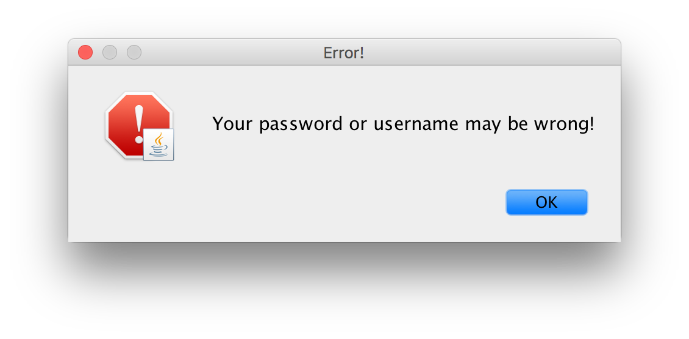
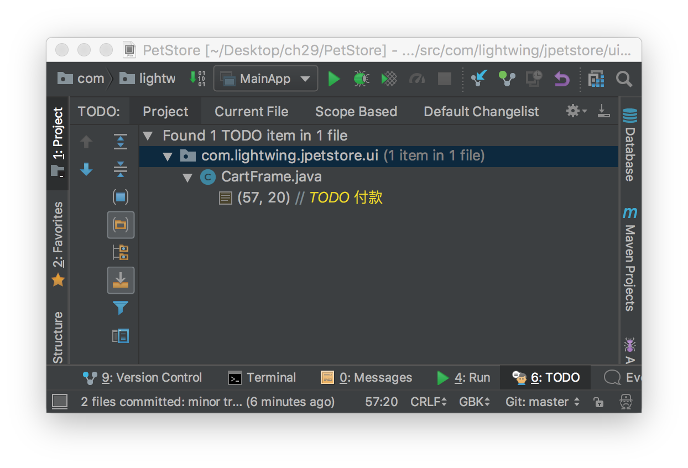

# Java_PetStore

# PetStore Demo 宠物商店项目

本章介绍 JavaSE 技术实现的 PetStore 宠物商店项目，所涉及的知识点：Java 面向对象、Lambda 
表达式、JavaSwing 技术、JDBC技术和数据库相关等知识，其中还会用到方方面面的 
Java 基础知识。

## 1 系统分析与设计

本节对 PetStore 宠物商店项目进行分析和设计，其中设计过程包括原型设计、数据库设计、架构设计和系统设计。

### 1.1 项目概述

PetStore 是 Sun（现在 Oracle）公司为了演示自己的 JavaEE 技术，而编写的一个基于 Web 宠物店项目，如图29-1所示为项目启动页面，项目介绍网站是 `http://www`
`.oracle.com/technetwork/java/index-136650.html`。PetStore 是典型的电子商务项目，是现在很多电商平台的雏形。技术方面主要是 JavaEE 技术，用户界面采用 JavaWeb 介绍实现。但本书介绍JavaSE 技术，不介绍 JavaWeb，所以本章的 PetStore 项目用户界面采用 JavaSwing 技术实现。


### 1.2 需求分析

PetStore 宠物商店项目主要功能如下：

- 用户登录
- 查询商品
- 添加商品到购物车
- 查看购物车
- 下订单
- 查看订单

采用用例分析方法描述用例图，如图1-2所示：


### 1.3 原型设计

原型设计草图对于开发人员、设计人员、测试人员、UI 设计人员以及用户都是非常重要的。PetStore 宠物商店项目原型设计图如图1-3所示。


### 1.4 数据库设计

Java 官方提供的 PetStore 宠物商店项目数据库设计比较复杂，根据如图1-2的用例图重新设计数据库，数据库设计模型如图1-4所示。


数据库设计模型中各个表说明如下：

#### 01 用户表

#### 02 商品表

#### 03 订单表

#### 04 订单明细表

### 1.5 架构设计

无论是庞大企业级系统，还是手机上的应用，都应该有效地组织程序代码。这就需要设计。而架构设计就是系统的「骨架」，它是源自于前人经验的总结和提炼，形式一种模式推而广之。但是遗憾的是本书的定位是初学者，并不是介绍架构设计方面的书。为了开发 PetStore 宠物商店项目需要，这里笔者给出最简单的架构设计结果。

世界著名软件设计大师 Martin Fowler 在他《企业应用架构模式》（英文名 
Patterns of Enterprise Application Architecture）一书中提到，为了有效地组织代码，一个系统应该分为三个基本层，如图1-5所示。「层」（Layer
）是相似功能的类和接口的集合，「层」之间是松耦合的，「层」的内部是高内聚的。


- 表示层：用户与系统交互的组件集合。用户通过这一层向系统提交请求或发出指令，系统通过这一层接收用户请求或指令，待指令消化吸收后再调用下一层，接着将调用结果展现到这一层。**表示层应该是轻薄的，不应该具有业务逻辑**。
- 服务层。系统的核心业务处理层。负责接收表示层的指令和数据，待指令和数据消化吸收后，再进行组织业务逻辑的处理，并将结果返回给表示层。
- 数据持久层。数据持久层用于访问持久化数据，持久化数据可以是保存在数据库、文件、其他系统或者网络数据。根据不同的数据来源，数据持久层会采用不同的技术，例如：如果数据保存到数据库中，则使用 JDBC 技术；如果数据保存 JSON 文件在，则需要 I/O 流和 JSON 解码技术实现。

MartinFowler 分层架构设计看起来像一个多层「蛋糕」，蛋糕师们在制作多层「蛋糕」的时候先做下层再做上层，最后做顶层。没有下层就没有上层，这叫作「上层依赖于下层」。为了降低松耦度，层之间还需要定义接口，通过接口隔离实现细节，上层调用者用只关心接口，不关心下一层的实现细节。

MartinFowler 分层架构是基本形式，在具体实现项目设计时，可能有所增加，也可能有所减少。本章实现的 PetStore 宠物商店项目，由于简化了需求，逻辑比较简单，可以不需要服务层，表示层可以直接访问数据持久层，如图1-6所示，表示层采用 Swing 技术实现，数据持久层采用 JDBC 技术实现。


### 1.6 系统设计

系统设计是在具体架构下的设计实现，PetStore 宠物商店项目主要分为表示层和数据数据持久层。下面分别介绍一下它们的具体实现。

#### 01 数据持久层设计

数据持久层在具体实现时，会采用 DAO（数据访问对象）设计模式，数据库中每一个数据表，对应一个 DAO 对象，每一个DAO对象中有访问数据表的 CRUD 四类操作。如图1-7所示 PetStore 
宠物商店项目的数据持久层类图，首先定义了4个 DAO 接口，这4个接口对应数据中4个表，接口定义的方法是对数据库表的 CRUD 操作。


#### 02 表示层

主要使用 Swing 技术，每一个界面就是一个窗口对象。在表示层中各个窗口是依据原型设计而来的。PetStore 宠物商店项目表示层类如图1-8所示，其中有三个窗口类，LoginFrame 用户登录窗口、CartFrame 购物车窗口和 ProductListFrame 商品列表窗口，它们有共同的父类 MyFrame，MyFrame 类是根据自己的项目情况进行的封装，从类图中可见 CartFrame 与 ProductListFrame 具有关联关系，CartFrame 包含一个对 ProductListFrame 的引用。


另外，CartFrame 与 ProductListFrame 会使用到表格，所以自定义了两个表模型 CartTableModel 和 ProductTableModel。

## 2 任务1：创建数据库

在设计完成之后，在编写 Java 代码之前，应该创建数据库。

### 2.1 迭代1.1：安装和配置 MySQL 数据库

首先应该为开发该项目，准备好数据库。本书推荐使用 MySQL 数据库，如果没有安装 MySQL 数据库，可以参考28.2.1节安装 MySQL 数据库。

### 2.2 迭代1.2：编写数据库 DDL 脚本

按照图2-4所示的数据库设计模型编写数据库 DDL 脚本。当然，也可以通过一些工具生成 DDL 脚本，然后把这个脚本放在数据库中执行就可以了。下面是编写的 DDL 脚本：

```sql
/* 创建数据库 */
CREATE DATABASE IF NOT EXISTS petstore;

USE petstore;

/* 用户表 */
CREATE TABLE IF NOT EXISTS account (
    userid VARCHAR(80) NOT NULL, /* 用户Id  */
    password VARCHAR(25) NOT NULL, /* 用户密码 */
    email VARCHAR(80) NOT NULL, /* 用户Email */
    name VARCHAR(80) NOT NULL, /* 用户名 */
    addr VARCHAR(80) NOT NULL, /* 地址 */
    city VARCHAR(80) NOT NULL, /*  所在城市 */
    country VARCHAR(20) NOT NULL, /*  国家 */
    phone VARCHAR(80) NOT NULL, /*  电话号码 */
    PRIMARY KEY (userid)
);

/* 商品表 */
CREATE TABLE IF NOT EXISTS product (
    productid VARCHAR(10) NOT NULL, /* 商品Id */
    category VARCHAR(10) NOT NULL, /* 商品类别 */
    cname VARCHAR(80) NULL, /* 商品中文名 */
    ename VARCHAR(80) NULL, /* 商品英文名 */
    image VARCHAR(20) NULL, /* 商品图片 */
    descn VARCHAR(255) NULL, /* 商品描述 */
    listprice DECIMAL(10, 2) NULL, /* 商品市场价 */
    unitcost DECIMAL(10, 2) NULL, /* 商品单价 */
    PRIMARY KEY (productid)
);

/* 订单表 */
CREATE TABLE IF NOT EXISTS orders (
    orderid BIGINT NOT NULL, /* 订单Id */
    userid VARCHAR(80) NOT NULL, /* 下订单的用户Id */
    orderdate DATETIME NOT NULL, /* 下订单时间 */
    status INT NOT NULL DEFAULT 0, /* 订单付款状态  0待付款  1已付款 */
    amount DECIMAL(10, 2) NOT NULL, /* 订单应付金额 */
    PRIMARY KEY (orderid)
);

/* 订单明细表 */
CREATE TABLE IF NOT EXISTS ordersdetail (
    orderid BIGINT NOT NULL, /* 订单Id */
    productid VARCHAR(10) NOT NULL, /* 商品Id */
    quantity INT NOT NULL, /* 商品数量 */
    unitcost DECIMAL(10, 2) NULL, /* 商品单价 */
    PRIMARY KEY (orderid, productid)
);
```

如果读者对于编写 DDL 脚本不熟悉，可以直接使用笔者编写好的 `jpetstore-mysql-schema-gbk.sql` 脚本文件，文件位于 PetStore 项目下 db 目录中。

### 2.3 迭代1.3：插入初始数据到数据库

PetStore 宠物商店项目有一些初始的数据，这些初始数据在创建数据库之后插入。这些插入数据的语句如下：

```sql
USE petstore;

/* 用户表数据 */
INSERT INTO account
VALUES ('j2ee', 'j2ee', 'yourname@yourdomain.com', '关东升', '北京丰台区', '北京', '中国', '18811588888');
INSERT INTO account VALUES
    ('ACID', 'ACID', 'acid@yourdomain.com', 'Tony', '901 San Antonio Road', 'Palo Alto', 'USA',
     '555-555-5555');

/* 商品表数据 */
INSERT INTO product
VALUES ('FI-SW-01', '鱼类', '神仙鱼', 'Angelfish', 'fish1.jpg', '来自澳大利亚的咸水鱼', 650, 400);
INSERT INTO product
VALUES ('FI-SW-02', '鱼类', '虎鲨', 'Tiger Shark', 'fish4.gif', '来自澳大利亚的咸水鱼', 850, 600);
INSERT INTO product VALUES ('FI-FW-01', '鱼类', '锦鲤', 'Koi', 'fish3.gif', '来自日本淡水鱼', 150, 120);
INSERT INTO product VALUES ('FI-FW-02', '鱼类', '金鱼', 'Goldfish', 'fish2.gif', '来自中国的淡水鱼', 150, 120);
INSERT INTO product
VALUES ('K9-BD-01', '狗类', '斗牛犬', 'Bulldog', 'dog2.gif', '来自英国友好的伴侣犬', 1500, 1200);
INSERT INTO product VALUES ('K9-PO-02', '狗类', '狮子狗', 'Poodle', 'dog6.gif', '来自法国可爱狗狗', 1250, 1000);
INSERT INTO product
VALUES ('K9-DL-01', '狗类', '斑点狗', 'Dalmation', 'dog5.gif', '有很多斑点的狗狗', 2150, 2000);
INSERT INTO product
VALUES ('K9-RT-01', '狗类', '金毛猎犬', 'Golden Retriever', 'dog1.gif', '很好的伴侣犬', 3800, 3400);
INSERT INTO product
VALUES ('K9-RT-02', '狗类', '拉布拉多犬', 'Labrador Retriever', 'dog5.gif', '很好的狩猎犬', 3600, 3020);
INSERT INTO product VALUES ('K9-CW-01', '狗类', '吉娃娃', 'Chihuahua', 'dog4.gif', '性格温顺的狗狗', 1500, 120);
INSERT INTO product
VALUES ('RP-SN-01', '爬行类', '响尾蛇', 'Rattlesnake', 'lizard3.gif', '可怕且危险的动物', 150, 110);
INSERT INTO product
VALUES ('RP-LI-02', '爬行类', '鬣蜥蜴', 'Iguana', 'lizard2.gif', '可随环境及光线强弱改变体色', 1600, 1203);
INSERT INTO product
VALUES ('FL-DSH-01', '猫类', '马恩岛猫', 'Manx', 'cat3.gif', '它能有效地减少老鼠的数量很有好处', 2503, 2120);
INSERT INTO product VALUES ('FL-DLH-02', '猫类', '波斯', 'Persian', 'cat1.gif', '非常好的家猫', 3150, 2620);
INSERT INTO product
VALUES ('AV-CB-01', '鸟类', '亚马逊鹦鹉', 'Amazon Parrot', 'bird4.gif', '寿命长达75年的大鸟', 3150, 3000);
INSERT INTO product VALUES ('AV-SB-02', '鸟类', '雀科鸣鸟', 'Finch', 'bird1.gif', '会唱歌的鸟儿', 150, 110);
```

## 3 任务2：初始化项目

本项目使用 IntelliJ IDEA。

### 3.1 任务2.1：配置项目构建路径

PetStore 项目创建完成后，需要参考如图3-9，在 PetStore 项目根目录下面创建普通文件夹 db。然后将 MySQL 数据库JDBC驱动程序 `mysql-connector-java-5.xxx-bin.jar` 拷贝到 db 目录，参考28.3.1节将驱动程序文件添加到项目的构建路径中。images 文件夹中内容是项目使用的图片。

```powershell
.
├── db
├── img
├── ooad
└── src
    ├── com
    │   └── lightwing
    │       └── jpetstore
    │           ├── dao
    │           │   └── mysql
    │           ├── domain
    │           └── ui
    └── images
```

### 3.2 任务2.2：添加资源图片

项目中会用到很多资源图片，为了打包发布项目方便，这些图片最好放到 src 源文件夹下，Eclipse 会将该文件夹下有文件一起复制到字节码文件夹中。参考图3-9在 src 文件夹下创建 images 文件夹，然后将本书配套资源中找到 images 中的图片，并复制到Eclipse项目的 images 文件夹中。

### 3.3 任务2.3：添加包

参考图3-9在 src 文件夹中创建如下4个包：

- `com.lightwing.jpetstore.ui`  # 表示层组件
- `com.lightwing.jpetstore.domain`  # 实体类
- `com.lightwing.jpetstore.dao`  # 数据持久层组件中 DAO 接口
- `com.lightwing.jpetstore.dao.mysql` # 数据持久层组件中 DAO 接口具体实现类，mysql 说明是 MySQL 数据库 DAO 对象。该包中还放置了访问 MySQ L数据库一些辅助类和配置文件。

## 4 任务3：编写数据持久层代码

IDEA 项目创建并初始化完成后，可以先编写数据持久层代码。

### 4.1 任务3.1：编写实体类

无论是数据库设计还是面向对象的架构设计都会「实体」，「实体」是系统中的「人」、「事」、「物」等名词，如用户、商品、订单和订单明细等。在数据库设计时它将演变为表，如用户表（account
）、商品表（product）、订单表（orders）和订单明细表（ordersdetail），在面向对象的架构设计时，实体将演变为「实体类」，如图4-10所示是 PetStore 宠物商店项目中的实体类，实体类属性与数据库表字段在是相似的，事实上它们描述的同一个事物，当然具有相同的属性，只是它们分别采用不同设计理念，实体类采用对象模型，表采用关系模式。


订单明细实体类 `OrderDetail` 的代码如下：

```java
package com.lightwing.jpetstore.domain;

// Order Detail 
public class OrderDetail {
    private long orderid;       // Order ID
    private String productid;   // Product ID
    private int quantity;       // Product Quantity
    private double unitcost;    // Unit Cost

    public long getOrderid() {
        return orderid;
    }

    public void setOrderid(long orderid) {
        this.orderid = orderid;
    }

    public double getUnitcost() {
        return unitcost;
    }

    public void setUnitcost(double unitcost) {
        this.unitcost = unitcost;
    }

    public String getProductid() {
        return productid;
    }

    public void setProductid(String productid) {
        this.productid = productid;
    }

    public int getQuantity() {
        return quantity;
    }

    public void setQuantity(int quantity) {
        this.quantity = quantity;
    }
}
```

从上述代码中可见实体类结构很简单，主要是一个私有属性，以及对这些属性方法的公有 
Getter 和 Setter 方法。在使用 IDEA 编程时只需要编写那些私有属性即可，然后通过 IDEA 工具生成 Getter 和 Setter 方法，具体步骤参考25
.6节。

订单实体类 `Order` 的代码如下：

```java
package com.lightwing.jpetstore.domain;

import java.util.Date;

public class Order {
    private long orderid;   // Order ID
    private String userid;  // User ID who takes the order
    private Date orderdate; // Time
    private int status;     // Order Status: 0 - Pending, 1 - Paid
    private double amount;  // Amount

    public int getStatus() {
        return status;
    }

    public void setStatus(int status) {
        this.status = status;
    }

    public double getAmount() {
        return amount;
    }

    public void setAmount(double amount) {
        this.amount = amount;
    }

    public long getOrderid() {
        return orderid;
    }

    public void setOrderid(long orderid) {
        this.orderid = orderid;
    }

    public String getUserid() {
        return userid;
    }

    public void setUserid(String userid) {
        this.userid = userid;
    }

    public Date getOrderdate() {
        return orderdate;
    }

    public void setOrderdate(Date orderdate) {
        this.orderdate = orderdate;
    }
}
```

用户实体类 `Account` 的代码如下：

```java
package com.lightwing.jpetstore.domain;

public class Account {
    private String userid;      // User ID
    private String password;    // Password
    private String email;       // Email
    private String username;    // Username
    private String addr;        // Address
    private String city;        // City
    private String country;     // Country
    private String phone;       // Telephone

    public String getUserid() {
        return userid;
    }

    public void setUserid(String userid) {
        this.userid = userid;
    }

    public String getPassword() {
        return password;
    }

    public void setPassword(String password) {
        this.password = password;
    }

    public String getEmail() {
        return email;
    }

    public void setEmail(String email) {
        this.email = email;
    }

    public String getUsername() {
        return username;
    }

    public void setUsername(String username) {
        this.username = username;
    }

    public String getAddr() {
        return addr;
    }

    public void setAddr(String addr) {
        this.addr = addr;
    }

    public String getCity() {
        return city;
    }

    public void setCity(String city) {
        this.city = city;
    }

    public String getCountry() {
        return country;
    }

    public void setCountry(String country) {
        this.country = country;
    }

    public String getPhone() {
        return phone;
    }

    public void setPhone(String phone) {
        this.phone = phone;
    }
}
```

商品实体类 `Product` 的代码如下：

```java
package com.lightwing.jpetstore.domain;

public class Product {
    private String productid;   // Product ID
    private String category;    // Category
    private String cname;       // Chinese Name
    private String ename;       // English Name
    private String image;       // Image 
    private String descn;       // Description
    private double listprice;   // List Price
    private double unitcost;    // Unit Cost

    public String getProductid() {
        return productid;
    }

    public void setProductid(String productid) {
        this.productid = productid;
    }

    public String getCategory() {
        return category;
    }

    public void setCategory(String category) {
        this.category = category;
    }

    public String getCname() {
        return cname;
    }

    public void setCname(String cname) {
        this.cname = cname;
    }

    public String getEname() {
        return ename;
    }

    public void setEname(String ename) {
        this.ename = ename;
    }

    public String getImage() {
        return image;
    }

    public void setImage(String image) {
        this.image = image;
    }

    public String getDescn() {
        return descn;
    }

    public void setDescn(String descn) {
        this.descn = descn;
    }

    public double getListprice() {
        return listprice;
    }

    public void setListprice(double listprice) {
        this.listprice = listprice;
    }

    public double getUnitcost() {
        return unitcost;
    }

    public void setUnitcost(double unitcost) {
        this.unitcost = unitcost;
    }
}
```

### 4.2 迭代3.2：编写 DAO 类

编写 DAO 类就没有实体类那么简单了，数据持久层开发的主要工作量主要是 DAO 类。图4-11是 DAO 实现类图。


#### 01 用户管理 DAO

用户管理 `AccountDao` 实现类 `AccountDaoImp` 代码如下：

```java
package com.lightwing.jpetstore.dao.mysql;

import com.lightwing.jpetstore.dao.AccountDao;
import com.lightwing.jpetstore.domain.Account;

import java.sql.Connection;
import java.sql.PreparedStatement;
import java.sql.ResultSet;
import java.sql.SQLException;
import java.util.List;

// 用户管理 DAO
public class AccountDaoImp implements AccountDao {
    @Override
    public List<Account> findAll() {
        return null;
    }

    @Override
    public Account findById(String userid) {
        Connection conn = null;
        PreparedStatement pstmt = null;
        ResultSet rs = null;
        Account account;

        try {
            // 2.创建数据库连接
            conn = DBHelper.getConnection();
            // 3. 创建语句对象
            String sql = "SELECT " +
                    "`userid`, `password`, `email`, `name`, `addr`,`city`, `country`, `phone` " +
                    "FROM `account` " +
                    "WHERE `userid` = ?";
            pstmt = conn.prepareStatement(sql);
            // 4. 绑定参数
            pstmt.setString(1, userid);
            // 5. 执行查询（R）
            rs = pstmt.executeQuery();
            // 6. 遍历结果集
            if (rs.next()) {
                account = new Account();
                account.setUserid(rs.getString("userid"));
                account.setPassword(rs.getString("password"));
                account.setEmail(rs.getString("email"));
                account.setUsername(rs.getString("name"));
                account.setAddr(rs.getString("addr"));
                account.setUserid(rs.getString("userid"));
                account.setCity(rs.getString("city"));
                account.setCountry(rs.getString("country"));
                account.setPhone(rs.getString("phone"));
                return account;
            }
        } catch (SQLException e) {
            e.printStackTrace();
        } finally {
            if (rs != null) {
                try {
                    rs.close();
                } catch (SQLException ignored) {
                }
            }

            if (pstmt != null) {
                try {
                    pstmt.close();
                } catch (SQLException ignored) {
                }
            }

            if (conn != null) {
                try {
                    conn.close();
                } catch (SQLException ignored) {
                }
            }
        }
        return null;
    }

    @Override
    public int create(Account account) {
        return 0;
    }

    @Override
    public int modify(Account account) {
        return 0;
    }

    @Override
    public int remove(Account account) {
        return 0;
    }
}
```

`AccountDao` 接口中定义了5个抽象方法。但这些方法，在本项目中只需要实现 `findById()` 方法。具体代码不再赘述。

#### 02 商品管理 DAO

商品管理 `ProductDao` 实现类 `ProductDaoImp` 代码如下：

```java
package com.lightwing.jpetstore.dao.mysql;

import com.lightwing.jpetstore.dao.ProductDao;
import com.lightwing.jpetstore.domain.Product;

import java.sql.Connection;
import java.sql.PreparedStatement;
import java.sql.ResultSet;
import java.sql.SQLException;
import java.util.ArrayList;
import java.util.List;

// 商品管理 DAO
public class ProductDaoImp implements ProductDao {
    @Override
    public List<Product> findAll() {
        String sql = "SELECT `productid`, `category`, `cname`, `ename`, `image`,"
                + "`listprice`, `unitcost`, `descn` " +
                "FROM `product`";
        List<Product> products = new ArrayList<Product>();
        try (// 2.创建数据库连接
             Connection conn = DBHelper.getConnection();
             // 3. 创建语句对象
             PreparedStatement pstmt = conn.prepareStatement(sql);
             // 4. 绑定参数
             // 5. 执行查询（R）
             ResultSet rs = pstmt.executeQuery()) {
            // 6. 遍历结果集
            while (rs.next()) {
                Product p = new Product();
                p.setProductid(rs.getString("productid"));
                p.setCategory(rs.getString("category"));
                p.setCname(rs.getString("cname"));
                p.setEname(rs.getString("ename"));
                p.setImage(rs.getString("image"));
                p.setListprice(rs.getDouble("listprice"));
                p.setUnitcost(rs.getDouble("unitcost"));
                p.setDescn(rs.getString("descn"));
                products.add(p);
            }
        } catch (SQLException e) {
            e.printStackTrace();
        }
        return products;
    }

    @Override
    public List<Product> findByCategory(String category) {
        Connection conn = null;
        PreparedStatement pstmt = null;
        ResultSet rs = null;
        List<Product> products = new ArrayList<Product>();

        try {
            // 2.创建数据库连接
            conn = DBHelper.getConnection();
            // 3. 创建语句对象
            String sql = "SELECT " +
                    "`productid`, `category`, `cname`, `ename`, `image`, `listprice`, `unitcost`," +
                    " `descn` "
                    + "FROM `product` WHERE `category` = ?";
            pstmt = conn.prepareStatement(sql);
            // 4. 绑定参数
            pstmt.setString(1, category);
            // 5. 执行查询（R）
            rs = pstmt.executeQuery();
            // 6. 遍历结果集
            while (rs.next()) {
                Product p = new Product();
                p.setProductid(rs.getString("productid"));
                p.setCategory(rs.getString("category"));
                p.setCname(rs.getString("cname"));
                p.setEname(rs.getString("ename"));
                p.setImage(rs.getString("image"));
                p.setListprice(rs.getDouble("listprice"));
                p.setUnitcost(rs.getDouble("unitcost"));
                p.setDescn(rs.getString("descn"));
                products.add(p);
            }
        } catch (SQLException e) {
            e.printStackTrace();
        } finally {
            if (rs != null) {
                try {
                    rs.close();
                } catch (SQLException ignored) {
                }
            }

            if (pstmt != null) {
                try {
                    pstmt.close();
                } catch (SQLException ignored) {
                }
            }

            if (conn != null) {
                try {
                    conn.close();
                } catch (SQLException ignored) {
                }
            }
        }

        return products;
    }

    @Override
    public Product findById(String productid) {
        Connection conn = null;
        PreparedStatement pstmt = null;
        ResultSet rs = null;

        try {
            // 2.创建数据库连接
            conn = DBHelper.getConnection();
            // 3. 创建语句对象
            String sql = "SELECT " +
                    "`productid`, `category`, `cname`, `ename`, `image`, `listprice`, `unitcost`," +
                    "`descn` "
                    + "FROM `product` WHERE `productid` = ?";
            pstmt = conn.prepareStatement(sql);
            // 4. 绑定参数
            pstmt.setString(1, productid);
            // 5. 执行查询（R）
            rs = pstmt.executeQuery();

            // 6. 遍历结果集
            if (rs.next()) {
                Product p = new Product();
                p.setProductid(rs.getString("productid"));
                p.setCategory(rs.getString("category"));
                p.setCname(rs.getString("cname"));
                p.setEname(rs.getString("ename"));
                p.setImage(rs.getString("image"));
                p.setListprice(rs.getDouble("listprice"));
                p.setUnitcost(rs.getDouble("unitcost"));
                p.setDescn(rs.getString("descn"));
                return p;
            }
        } catch (SQLException e) {
            e.printStackTrace();
        } finally {
            if (rs != null) {
                try {
                    rs.close();
                } catch (SQLException ignored) {
                }
            }

            if (pstmt != null) {
                try {
                    pstmt.close();
                } catch (SQLException ignored) {
                }
            }

            if (conn != null) {
                try {
                    conn.close();
                } catch (SQLException ignored) {
                }
            }
        }

        return null;
    }

    @Override
    public int create(Product product) {
        return 0;
    }

    @Override
    public int modify(Product product) {
        return 0;
    }

    @Override
    public int remove(Product product) {
        return 0;
    }
}
```

`ProductDao` 接口中定义了6个抽象方法。但这些方法，在本项目中只需要实现 `findById()`、`findAll()`、`findByCategory()` 和 `findById()` 方法。

#### 03 订单管理 DAO

订单管理 `OrderDao` 实现类 `OrderDaoImp` 代码如下：

```java
package com.lightwing.jpetstore.dao.mysql;

import com.lightwing.jpetstore.dao.OrderDao;
import com.lightwing.jpetstore.domain.Order;

import java.sql.Connection;
import java.sql.PreparedStatement;
import java.sql.ResultSet;
import java.sql.SQLException;
import java.util.ArrayList;
import java.util.List;

// 订单管理 DAO
public class OrderDaoImp implements OrderDao {
    @Override
    public List<Order> findAll() {
        String sql = "SELECT `orderid`, `userid`, `orderdate` " +
                "FROM `product`";
        List<Order> orderList = new ArrayList<Order>();
        try (// 2.创建数据库连接
             Connection conn = DBHelper.getConnection();
             // 3. 创建语句对象
             PreparedStatement pstmt = conn.prepareStatement(sql);
             // 4. 绑定参数
             // 5. 执行查询（R）
             ResultSet rs = pstmt.executeQuery()) {
            // 6. 遍历结果集
            while (rs.next()) {
                Order order = new Order();
                order.setOrderid(rs.getInt("orderid"));
                order.setUserid(rs.getString("userid"));
                order.setOrderdate(rs.getDate("orderdate"));
                orderList.add(order);
            }
        } catch (SQLException e) {
            e.printStackTrace();
        }
        return orderList;
    }

    @Override
    public int create(Order order) {

        try (// 2.创建数据库连接
             Connection conn = DBHelper.getConnection();
             // 3. 创建语句对象
             PreparedStatement pstmt = conn.prepareStatement(
                     "INSERT INTO `orders` (`orderid`, `userid`, `orderdate`,`status`,`amount`)"
                             + "VALUES (?, ?, ?, ?, ?)")) {
            // 4. 绑定参数
            pstmt.setLong(1, order.getOrderid());
            pstmt.setString(2, order.getUserid());
            java.util.Date date = order.getOrderdate();
            pstmt.setTimestamp(3, new java.sql.Timestamp(date.getTime()));
            pstmt.setInt(4, order.getStatus());
            pstmt.setDouble(5, order.getAmount());
            // 5. 执行修改（C、U、D）
            int affectedRows = pstmt.executeUpdate();
            System.out.printf("成功插入 %d 条数据。\n", affectedRows);
        } catch (SQLException e) {
            return -1;
        }
        return 0;
    }

    @Override
    public Order findById(int orderid) {
        return null;
    }

    @Override
    public int modify(Order order) {
        return 0;
    }

    @Override
    public int remove(Order order) {
        return 0;
    }
}
```

`OrderDao` 接口中定义了5个抽象方法。但这些方法，在本项目中只需要实现 `findAll()` 和 create()
 方法。

#### 04 订单明细管理 `DAO` 

订单明细管理 `OrderDetailDao` 实现类 `OrderDetailDaoImp` 代码如下：

```java
package com.lightwing.jpetstore.dao.mysql;

import com.lightwing.jpetstore.dao.OrderDetailDao;
import com.lightwing.jpetstore.domain.OrderDetail;

import java.sql.Connection;
import java.sql.PreparedStatement;
import java.sql.ResultSet;
import java.sql.SQLException;
import java.util.List;

// 订单明细管理 DAO
public class OrderDetailDaoImp implements OrderDetailDao {
    @Override
    public List<OrderDetail> findAll() {
        return null;
    }

    @Override
    public OrderDetail findByPK(int orderid, String productid) {

        Connection conn = null;
        PreparedStatement pstmt = null;
        ResultSet rs = null;
        OrderDetail orderDetail = null;

        try {
            // 2.创建数据库连接
            conn = DBHelper.getConnection();
            // 3. 创建语句对象
            String sql = "SELECT orderid,productid,quantity,unitprice "
                    + "FROM ordersdetail WHERE orderid = ? AND productid = ?";
            pstmt = conn.prepareStatement(sql);
            // 4. 绑定参数
            pstmt.setInt(1, orderid);
            pstmt.setString(2, productid);
            // 5. 执行查询（R）
            rs = pstmt.executeQuery();
            // 6. 遍历结果集
            if (rs.next()) {
                orderDetail = new OrderDetail();
                orderDetail.setOrderid(rs.getInt("orderid"));
                orderDetail.setProductid(rs.getString("productid"));
                orderDetail.setQuantity(rs.getInt("quantity"));
                orderDetail.setUnitcost(rs.getDouble("unitcost"));
                return orderDetail;
            }
        } catch (SQLException e) {
            e.printStackTrace();
        } finally { // 释放资源
            if (rs != null) {
                try {
                    rs.close();
                } catch (SQLException ignored) {
                }
            }
            if (pstmt != null) {
                try {
                    pstmt.close();
                } catch (SQLException ignored) {
                }
            }
            if (conn != null) {
                try {
                    conn.close();
                } catch (SQLException ignored) {
                }
            }
        }
        return null;
    }

    @Override
    public int create(OrderDetail orderDetail) {
        try ( // 2.创建数据库连接
              Connection conn = DBHelper.getConnection();
              // 3. 创建语句对象
              PreparedStatement pstmt = conn
                      .prepareStatement(
                              "INSERT INTO ordersdetail "
                                      + "( `orderid`, `productid`, `quantity`, `unitcost`) " +
                                      "VALUES (?, ?, ?, ?)")) {

            // 4. 绑定参数
            pstmt.setLong(1, orderDetail.getOrderid());
            pstmt.setString(2, orderDetail.getProductid());
            pstmt.setInt(3, orderDetail.getQuantity());
            pstmt.setDouble(4, orderDetail.getUnitcost());

            // 5. 执行修改（C、U、D）
            int affectedRows = pstmt.executeUpdate();
            System.out.printf("成功插入 %d 条数据。\n", affectedRows);
        } catch (SQLException e) {
            return -1;
        }
        return 0;
    }

    @Override
    public int modify(OrderDetail orderDetail) {
        return 0;
    }

    @Override
    public int remove(OrderDetail orderDetail) {
        return 0;
    }
}
```

`OrderDetailDao` 接口中定义了5个抽象方法。但这些方法，在本项目中只需要实现 `findByPK()` 和 `create()` 方法。

### 4.3 迭代3.3：数据库帮助类 `DBHelper`

数据库帮助类 DBHelper 可以进行 JDBC 驱动程序加载以及获得数据库连接。具体实现代码如下：

```java
package com.lightwing.jpetstore.dao.mysql;

import java.io.IOException;
import java.io.InputStream;
import java.sql.Connection;
import java.sql.DriverManager;
import java.sql.SQLException;
import java.util.Properties;

// 数据库辅助类
class DBHelper {
    // 连接数据库url
    private static String url;
    // 创建Properties对象
    private static Properties info = new Properties();

    // 1.驱动程序加载
    static { ①
        // 获得属性文件输入流
        InputStream input = DBHelper.class.getClassLoader()
                .getResourceAsStream("com/lightwing/jpetstore/dao/mysql/config.properties");
        try {
            // 加载属性文件内容到 Properties 对象
            info.load(input);
            // 从属性文件中取出 URL
            url = info.getProperty("url");
            // 从属性文件中取出driver
            String driverClassName = info.getProperty("driver");
            Class.forName(driverClassName);
            System.out.println("驱动程序加载成功...");
        } catch (ClassNotFoundException e) {
            System.out.println("驱动程序加载失败...");
        } catch (IOException e) {
            System.out.println("加载属性文件失败...");
        }
    } ②

    // 获得数据库连接
    static Connection getConnection() throws SQLException {
        // 创建数据库连接
        Connection conn = DriverManager.getConnection(url, info);
        return conn;
    }
}
```

上述代码第①行~第②行通过静态代码库加载数据库驱动程序，并且在静态代码块中读取配置文件 `config.properties` 信息，该配置文件位于 `com.lightwing.jpetstore.dao.mysql` 包中，内容如下：

```properties
## this is db config file
driver=com.mysql.jdbc.Driver
url=jdbc:mysql://localhost:3306/petstore
user=root
password=canton0520
useSSL=false
verifyServerCertificate=false
```

代码第③行提供了获得数据库连接方法，这是一个静态方法使用起来比较方便。

## 5 任务4：编写表示层代码

从客观上讲，表示层开发的工作量是很大的，不仅有很多细节工作。

### 5.1 迭代4.1：编写启动类

JavaSE 应用程序需要有一个具有 main 主方法的类，它是项目启动类，代码如下：

```java
package com.lightwing.jpetstore.ui;

import com.lightwing.jpetstore.domain.Account;

// 启动类
public class MainApp {
    // 用户登录成功后，保存当前用户信息
    static Account account; ①

    public static void main(String[] args) {
        LoginFrame frame = new LoginFrame();
        frame.setVisible(true);
    }
}
```

在 main 主方法中实例化用户登录窗口—— LoginFrame 类。另外，代码第①行声明静态变量 account，当用户登录成功后 account 用来保存后用户信息。静态变量 account 
可以在其他类中方便访问。这是为了模拟 Web 应用开发中的会话（Session）对象，等用户打开浏览器，登录 Web 系统后，服务器端会将用户信息保存到会话对象中。

### 5.2 迭代4.2：编写自定义窗口类——MyFrame

由于 Swing 提供的 JFrame 类启动窗口后默认位于在屏幕的左上角，而本项目中所有的窗口都屏幕居中的，因此自定义了窗口类 MyFrame，MyFrame 代码如下：

```java
package com.lightwing.jpetstore.ui;

import javax.swing.*;
import java.awt.*;
import java.awt.event.WindowAdapter;
import java.awt.event.WindowEvent;

// 这是一个屏幕居中的自定义窗口
public class MyFrame extends JFrame {
    public MyFrame(String title, int width, int height) {
        super(title);
        // 设置窗口大小
        setSize(width, height);
        // 计算窗口位于屏幕中心的坐标
        // 获得当前屏幕的宽
        double screenWidth = Toolkit.getDefaultToolkit().getScreenSize().getWidth();
        int x = (int) (screenWidth - width) / 2; ①
        // 获得当前屏幕的高
        double screenHeight = Toolkit.getDefaultToolkit().getScreenSize().getHeight();
        int y = (int) (screenHeight - height) / 2; ②
        // 设置窗口位于屏幕中心
        setLocation(x, y);
        // 注册窗口事件
        addWindowListener(new WindowAdapter() {
            // 单击窗口关闭按钮时调用
            public void windowClosing(WindowEvent e) {
                // 退出系统
                System.exit(0);
            }
        });
    }
}
```

上述代码第①行和第②行是获取当前屏幕的宽和高，具体的计算过程，见代码第③行和第④行，具体的原理在25.5.7节已经介绍过程，这里不再赘述。另外，代码第⑤行注册窗口事件，当用户单击窗口的关闭按钮时调用 `System.exit(0)` 语句退出系统，继承 MyFrame 类的所有窗口都可以单击关闭按钮时退出系统。

### 5.3 迭代4.3：用户登录窗口

MainApp 类运行时会启动用户登录窗口，界面如图5-12所示，界面中有一个文本框、一个密码框和两个按钮。用户输入账号和密码，单击「确定」按钮，如果输入的账号和密码正确，则登录成功进入商品列表窗口；如果输入的不正确，则弹出如图5-13所示的对话框。


用户登录窗口 `LoginFrame` 代码如下：

```java
package com.lightwing.jpetstore.ui;

import com.lightwing.jpetstore.dao.AccountDao;
import com.lightwing.jpetstore.dao.mysql.AccountDaoImp;
import com.lightwing.jpetstore.domain.Account;

import javax.swing.*;
import java.awt.*;

// 用户登录窗口
public class LoginFrame extends MyFrame {

    private JTextField txtAccountId;
    private JPasswordField txtPassword;

    public LoginFrame() {
        super("User Login", 400, 230);
        // 设置布局管理为绝对布局
        getContentPane().setLayout(null);
        JLabel label1 = new JLabel();
        label1.setHorizontalAlignment(SwingConstants.RIGHT);
        label1.setBounds(51, 33, 83, 30);
        getContentPane().add(label1);
        label1.setText("Account: ");
        label1.setFont(new Font("CamingoCode", Font.PLAIN, 15));

        txtAccountId = new JTextField(10);
        txtAccountId.setText("j2ee");
        txtAccountId.setBounds(158, 33, 157, 30);
        txtAccountId.setFont(new Font("CamingoCode", Font.PLAIN, 15));
        getContentPane().add(txtAccountId);

        JLabel label2 = new JLabel();
        label2.setText("Password: ");
        label2.setFont(new Font("CamingoCode", Font.PLAIN, 15));
        label2.setHorizontalAlignment(SwingConstants.RIGHT);
        label2.setBounds(51, 85, 83, 30);
        getContentPane().add(label2);

        txtPassword = new JPasswordField(10);
        txtPassword.setText("j2ee");
        txtPassword.setBounds(158, 85, 157, 30);
        getContentPane().add(txtPassword);

        JButton btnOk = new JButton();
        btnOk.setText("Confirm");
        btnOk.setFont(new Font("CamingoCode", Font.PLAIN, 15));
        btnOk.setBounds(61, 140, 100, 30);
        getContentPane().add(btnOk);

        JButton btnCancel = new JButton();
        btnCancel.setText("Cancel");
        btnCancel.setFont(new Font("CamingoCode", Font.PLAIN, 15));
        btnCancel.setBounds(225, 140, 100, 30);
        getContentPane().add(btnCancel);

        // 注册 btnOk 的 ActionEvent 事件监听器
        btnOk.addActionListener(e -> {
            AccountDao accountDao = new AccountDaoImp();
            Account account = accountDao.findById(txtAccountId.getText());
            String passwordText = new String(txtPassword.getPassword());
            if (account != null && passwordText.equals(account.getPassword())) {
                System.out.println("登录成功。");
                ProductListFrame form = new ProductListFrame();
                form.setVisible(true);
                setVisible(false);
                //用户登录成功后，将用户信息保存到 MainApp.account 静态变量中
                MainApp.account = account;
            } else {
                JLabel label = new JLabel("Your password or username may be wrong!");
                label.setFont(new Font("CamingoCode", Font.PLAIN, 15));
                JOptionPane.showMessageDialog(null, label,
                        "Error!", JOptionPane.ERROR_MESSAGE);
            }

        });

        // 注册 btnCancel 的 ActionEvent 事件监听器
        btnCancel.addActionListener(e -> {
            // 退出系统
            System.exit(0);
        });
    }
}
```

上述代码第①行是用户单击「确定」按钮调用代码块。代码第②行是创建 `AccountDaoImp` 对象，代码第③行是通过 DAO 对象调用 `findById()` 方法，该方法是通过用户账号查询用户信息。代码第④行从密码框中取出密码。代码第⑤行比较窗口界面中的密码与从数据库中查询的密码是否一致，如果一致则登录成功；否则登录失败，失败时弹出对话框，代码第⑥行 `JOptionPane.showMessageDialog` 方法可以弹出对话框，JOptionPane 类还有类似的静态方法：

- `showConfirmDialog`：弹出确认框，可以 Yes、No、Ok 和 Cancel 等按钮。

- `showInputDialog`：弹出提示输入对话框。

- `showMessageDialog`：弹出消息提示对话框。

代码第⑥行 `showMessageDialog` 方法第一个参数是设置对话框所在的窗口，如果是当前窗口则设置为 `null`，第二个参数要显示的消息，第三个参数是对话框标题，第四个参数要显示的消息类型，这些类型有：

ERROR_MESSAGE、INFORMATION_MESSAGE、WARNING_MESSAGE、QUESTION_MESSAGE 
或 PLAIN_MESSAGE，其中 ERROR_MESSAGE 是错误消息类型。

### 5.4 迭代4.4：商品列表窗口

登录成功后会进行商品列表窗口，如图5-14所示。在商品列表窗口是分栏显示的，左栏是商品列表，右栏是商品明细信息。商品列表窗口是 PetStore 项目的最核心窗口，在该窗口可进行操作如下：

- 查看商品信息：当左栏的表格中选择某一个商品时，右栏会显示该商品的详细信息。
- 选择商品类型进行查询：用户可以选择商品类型，单击「查询」按钮根据商品类型进行查询，如图5-15所示，选中「鱼类」商品类型时查询结果。
- 重置查询：根据商品类型查询后，如果想返回查询之前的状态，可以单击「重置」按钮重置商品列表，回到如图5-14所示界面。
- 添加商品到购物车：用户在商品列表中选中商品后，可以单击「添加到购物车」按钮，将选中的商品添加到购物车中，注意用户每单击一次增加一次该商品的数量到购物车。
- 查看购物车：用户单击「查看购物车」按钮后窗口会跳转到购物车窗口。


商品列表窗口 `ProductListFrame` 代码如下：

```java
package com.lightwing.jpetstore.ui;

import com.lightwing.jpetstore.dao.ProductDao;
import com.lightwing.jpetstore.dao.mysql.ProductDaoImp;
import com.lightwing.jpetstore.domain.Product;

import javax.swing.*;
import javax.swing.table.TableModel;
import java.awt.*;
import java.util.HashMap;
import java.util.List;
import java.util.Map;

// 商品列表窗口
public class ProductListFrame extends MyFrame {
    private JTable table;
    private JLabel lblImage;
    private JLabel lblListprice;
    private JLabel lblDescn;
    private JLabel lblUnitcost;

    // 商品列表集合
    private List<Product> products = null;
    // 创建商品Dao对象
    private ProductDao dao = new ProductDaoImp();

    // 购物车，键是选择的商品Id，值是商品的数量
    private Map<String, Integer> cart = new HashMap<String, Integer>();
    // 选择的商品索引
    private int selectedRow = -1;

    public ProductListFrame() {
        super("Product List", 1000, 700);
        // 查询所有商品
        products = dao.findAll();

        // 添加顶部搜索面板
        getContentPane().add(getSearchPanel(), BorderLayout.NORTH);

        // 创建分栏面板
        JSplitPane splitPane = new JSplitPane();
        // 设置指定分隔条位置，从窗格的左边到分隔条的左边
        splitPane.setDividerLocation(600);
        // 设置左侧面板
        splitPane.setLeftComponent(getLeftPanel());
        // 设置右侧面板
        splitPane.setRightComponent(getRightPanel());
        // 把分栏面板添加到内容面板
        getContentPane().add(splitPane, BorderLayout.CENTER);
    }

    // 初始化搜索面板
    private JPanel getSearchPanel() {

        JPanel searchPanel = new JPanel();
        FlowLayout flowLayout = (FlowLayout) searchPanel.getLayout();
        flowLayout.setVgap(20);
        flowLayout.setHgap(40);

        JLabel lbl = new JLabel("选择商品类别：");
        lbl.setFont(new Font("CamingoCode", Font.PLAIN, 15));
        searchPanel.add(lbl);

        String[] categorys = {"鱼类", "狗类", "爬行类", "猫类", "鸟类"};
        JComboBox comboBox = new JComboBox(categorys);
        comboBox.setFont(new Font("CamingoCode", Font.PLAIN, 15));
        searchPanel.add(comboBox);

        JButton btnGo = new JButton("Search");
        btnGo.setFont(new Font("CamingoCode", Font.PLAIN, 15));
        searchPanel.add(btnGo);

        JButton btnReset = new JButton("Reset");
        btnReset.setFont(new Font("CamingoCode", Font.PLAIN, 15));
        searchPanel.add(btnReset);

        // 注册查询按钮的ActionEvent事件监听器
        btnGo.addActionListener(e -> {
            // 所选择的类别
            String category = (String) comboBox.getSelectedItem();
            // 按照类别进行查询
            products = dao.findByCategory(category);
            TableModel model = new ProductTableModel(products);
            table.setModel(model);
        });

        // 注册重置按钮的ActionEvent事件监听器
        btnReset.addActionListener(e -> {
            products = dao.findAll();
            TableModel model = new ProductTableModel(products);
            table.setModel(model);
        });

        return searchPanel;
    }

    // 初始化右侧面板
    private JPanel getRightPanel() {

        JPanel rightPanel = new JPanel();
        rightPanel.setBackground(Color.WHITE);

        rightPanel.setLayout(new GridLayout(2, 1, 0, 0));

        lblImage = new JLabel();
        rightPanel.add(lblImage);
        lblImage.setHorizontalAlignment(SwingConstants.CENTER);

        JPanel detailPanel = new JPanel();
        detailPanel.setBackground(Color.WHITE);
        rightPanel.add(detailPanel);
        detailPanel.setLayout(new GridLayout(8, 1, 0, 5));

        JSeparator separator_1 = new JSeparator();
        detailPanel.add(separator_1);

        lblListprice = new JLabel();
        detailPanel.add(lblListprice);
        // 设置字体
        lblListprice.setFont(new Font("CamingoCode", Font.PLAIN, 16));

        lblUnitcost = new JLabel();
        detailPanel.add(lblUnitcost);
        // 设置字体
        lblUnitcost.setFont(new Font("CamingoCode", Font.PLAIN, 16));

        lblDescn = new JLabel();
        detailPanel.add(lblDescn);
        // 设置字体
        lblDescn.setFont(new Font("CamingoCode", Font.PLAIN, 16));

        JSeparator separator_2 = new JSeparator();
        detailPanel.add(separator_2);

        JButton btnAdd = new JButton("添加到购物车");
        btnAdd.setFont(new Font("CamingoCode", Font.PLAIN, 15));
        detailPanel.add(btnAdd);

        // 布局占位使用
        JLabel lb1 = new JLabel("");
        detailPanel.add(lb1);

        JButton btnCheck = new JButton("查看购物车");
        btnCheck.setFont(new Font("CamingoCode", Font.PLAIN, 15));
        detailPanel.add(btnCheck);

        // 注册【添加到购物车】按钮的ActionEvent事件监听器
        btnAdd.addActionListener(e -> {
            if (selectedRow < 0) {
                return;
            }
            // 添加商品到购物车处理
            Product selectProduct = products.get(selectedRow);
            String productid = selectProduct.getProductid();

            if (cart.containsKey(productid)) {
                // 购物车中已经有该商品，获得商品数量
                Integer quantity = cart.get(productid);
                cart.put(productid, ++quantity);
            } else {
                // 购物车中还没有该商品
                cart.put(productid, 1);
            }

            System.out.println(cart);
        });

        // 注册「查看购物车」按钮的 ActionEvent 事件监听器
        btnCheck.addActionListener(e -> {
            CartFrame cartFrame = new CartFrame(cart, this);
            cartFrame.setVisible(true);
            setVisible(false);
        });
        return rightPanel;
    }

    // 初始化左侧面板
    private JScrollPane getLeftPanel() {

        JScrollPane leftScrollPane = new JScrollPane();
        // 将表格作为滚动面板的个视口视图
        leftScrollPane.setViewportView(getTable());
        return leftScrollPane;
    }

    // 初始化左侧面板中的表格控件
    private JTable getTable() {
        TableModel model = new ProductTableModel(this.products);
        if (table == null) {
            table = new JTable(model);
            // 设置表中内容字体
            table.setFont(new Font("CamingoCode", Font.PLAIN, 16));
            // 设置表列标题字体
            table.getTableHeader().setFont(new Font("CamingoCode", Font.BOLD, 16));
            // 设置表行高
            table.setRowHeight(51);
            table.setRowSelectionAllowed(true);
            table.setSelectionMode(ListSelectionModel.SINGLE_SELECTION);
            ListSelectionModel rowSelectionModel = table.getSelectionModel();
            rowSelectionModel.addListSelectionListener(e -> {
                ListSelectionModel lsm = (ListSelectionModel) e.getSource();
                selectedRow = lsm.getMinSelectionIndex();
                if (selectedRow < 0) {
                    return;
                }
                // 更新右侧面板内容
                Product p = products.get(selectedRow);
                String petImage = String.format("/images/%s", p.getImage());
                ImageIcon icon = new ImageIcon(ProductListFrame.class.getResource(petImage));
                lblImage.setIcon(icon);

                String descn = p.getDescn();
                lblDescn.setText("商品描述：" + descn);

                double listprice = p.getListprice();
                String slistprice = String.format("商品市场价：%.2f", listprice);
                lblListprice.setText(slistprice);

                double unitcost = p.getUnitcost();
                String slblUnitcost = String.format("商品单价：%.2f", unitcost);
                lblUnitcost.setText(slblUnitcost);
            });
        } else {
            table.setModel(model);
        }
        return table;
    }
}
```

上述代码第①行的 `roducts=dao.findAll()` 语句是查询所有数据，单击「reset」按钮也调用 `dao.findAll()` 语句查询所有数据，见代码第③行。

代码第②行代码块是用户单击「查询」按钮调用的。

代码第④行的代码块是用户单击「添加到购物车」按钮调用的，其中代码第⑤行判断购物车中是否已经有了选中的商品，如果有则通过代码第⑥行取出商品数量，代码第⑦行是将商品数量加一后，再重新放回到购物车中。如果没有商品则将该商品添加到购物车中，商品数量为1。

代码第⑨行是单击“查看购物车”按钮时调用的代码块。此时当前界面会调转到购物车窗口。

代码第⑩行是用户选中表格中某一行时调用的代码块，在这里根据用户选中的商品更新右边的详细商品信息。

代码第⑪行是获得图片相对路径，它们属于资源目录（即 src 源文件夹）。代码第⑫行的`ProductListFrame.class.getResource(petImage)`语句可以获得图片文件运行时的绝对路径。商品列表窗口中使用了自定义表格模 `ProductTableModel`，`ProductTableModel` 代码如下：

```java
package com.lightwing.jpetstore.ui;

import com.lightwing.jpetstore.domain.Product;

import javax.swing.table.AbstractTableModel;
import java.util.List;

// 商品列表表格模型
public class ProductTableModel extends AbstractTableModel {
    // 表格列名 columnNames
    private String[] columnNames = {
            "Product ID",
            "Category",
            "Chinese Name",
            "English Name"
    };

    // 表格中的数据内容保存在 List 集合中
    private List<Product> data;

    public ProductTableModel(List<Product> data) {
        this.data = data;
    }

    // 返回列数
    @Override
    public int getColumnCount() {
        return columnNames.length;
    }

    // 返回行数
    @Override
    public int getRowCount() {
        return data.size();
    }

    // 获得某行某列的数据，而数据保存在对象数组data中
    @Override
    public Object getValueAt(int rowIndex, int columnIndex) {

        // 每一行就是一个 Product 商品对象
        Product p = data.get(rowIndex);

        switch (columnIndex) {
            case 0:
                return p.getProductid();    // 第一列商品编号
            case 1:
                return p.getCategory();     // 第二列商品类别
            case 2:
                return p.getCname();        // 商品中文名
            default:
                return p.getEname();        // 商品英文名
        }
    }

    @Override
    public String getColumnName(int columnIndex) {
        return columnNames[columnIndex];
    }
}
```

上述表格模型代码继承了 `AbstractTableModel` 抽象类，表格中的数据保存在 `List<Product>` 集合中。类似的表格模型在25.6节介绍过，这里不再赘述。

### 5.5 迭代4.5：商品购物车窗口

当用户在商品列表窗口，单击了「查看购物车」按钮，则会跳转到商品购物车窗口，如图5-16所示。在该窗口可进行操作如下：

- 返回商品列表：当用户单击「返回商品列表」按钮时，界面跳转回上一级窗口（商品列表窗口），用户还可以重新添加新的到购物车。
- 修改商品数量：用户如果想修改商品数量，可以在购物车表格中双击某一商品数量单元格，使其进入编辑状态。用户只能输入大于0的数值，不能输入负数或非数值字符。
- 提交订单：如果商品选择完成，用户想提交订单，可以单击「提交订单」按钮生成订单，订单生成会在数据库中插入订单信息和订单明细信息。然后会弹出如图5-17所示订单等待付款确认对话框，如果用户单击「是」按钮则进入付款流程，由于付款需要实际的支付接口，因此付款功能未实现。如果用户单击「否」则退出系统。


商品购物车窗口 `CartFrame` 代码如下：

```java
package com.lightwing.jpetstore.ui;

import com.lightwing.jpetstore.dao.OrderDao;
import com.lightwing.jpetstore.dao.OrderDetailDao;
import com.lightwing.jpetstore.dao.ProductDao;
import com.lightwing.jpetstore.dao.mysql.OrderDaoImp;
import com.lightwing.jpetstore.dao.mysql.OrderDetailDaoImp;
import com.lightwing.jpetstore.dao.mysql.ProductDaoImp;
import com.lightwing.jpetstore.domain.Order;
import com.lightwing.jpetstore.domain.OrderDetail;
import com.lightwing.jpetstore.domain.Product;

import javax.swing.*;
import javax.swing.table.TableModel;
import java.awt.*;
import java.util.Date;
import java.util.Map;
import java.util.Set;

//商品购物车窗口
public class CartFrame extends MyFrame {
    private JTable table;
    // 购物车数据
    private Object[][] data = null;
    // 创建商品Dao对象
    private ProductDao dao = new ProductDaoImp();
    // 购物车，键是选择的商品Id，值是商品的数量
    private Map<String, Integer> cart;
    // 引用到上级Frame（ProductListFrame）
    private ProductListFrame productListFrame;

    public CartFrame(Map<String, Integer> cart, ProductListFrame productListFrame) {
        super("商品购物车", 1000, 700);
        this.cart = cart;
        this.productListFrame = productListFrame;
        JPanel topPanel = new JPanel();
        FlowLayout fl_topPanel = (FlowLayout) topPanel.getLayout();
        fl_topPanel.setVgap(10);
        fl_topPanel.setHgap(20);
        getContentPane().add(topPanel, BorderLayout.NORTH);
        JButton btnReturn = new JButton("返回商品列表");
        btnReturn.setFont(new Font("微软雅黑", Font.PLAIN, 15));
        topPanel.add(btnReturn);
        JButton btuSubmit = new JButton("提交订单");
        topPanel.add(btuSubmit);
        btuSubmit.setFont(new Font("微软雅黑", Font.PLAIN, 15));
        JScrollPane scrollPane = new JScrollPane();
        getContentPane().add(scrollPane, BorderLayout.CENTER);
        scrollPane.setViewportView(getTable());
        // 注册「提交订单」按钮的 ActionEvent 事件监听器
        btuSubmit.addActionListener(e -> {
            // 生成订单
            generateOrders();
            JLabel label = new JLabel("Congratulations, please pay!");
            label.setFont(new Font("微软雅黑", Font.PLAIN, 15));
            if (JOptionPane.showConfirmDialog(this, label, "信息", JOptionPane.YES_NO_OPTION) == JOptionPane.YES_OPTION) {
                // TODO 付款
                System.exit(0);
            } else
                System.exit(0);
        });
        // 注册「返回商品列表」按钮的 ActionEvent 事件监听器
        btnReturn.addActionListener(e -> {
            // 更新购物车
            for (Object[] aData : data) {
                // 商品编号
                String productid = (String)
                        aData[0];
                // 数量
                Integer quantity = (Integer) aData[3];
                cart.put(productid, quantity);
            }
            this.productListFrame.setVisible(true);
            setVisible(false);
        });
    }

    // 初始化左侧面板中的表格控件
    private JTable getTable() {
        // 准备表中数据
        data = new Object[cart.size()][5];
        Set<String> keys = this.cart.keySet();
        int indx = 0;

        for (String productid : keys) {
            Product p = dao.findById(productid);
            data[indx][0] = p.getProductid();// 商品编号
            data[indx][1] = p.getCname();// 商品名
            data[indx][2] = p.getUnitcost();// 商品单价
            data[indx][3] = cart.get(productid);// 数量
            // 计算商品应付金额
            double amount = (double) data[indx][2] * (int) data[indx][3];
            data[indx][4] = amount;
            indx++;
        }

        // 创建表数据模型
        TableModel model = new CartTableModel(data);
        if (table == null) {
            // 创建表
            table = new JTable(model);
            // 设置表中内容字体
            table.setFont(new Font("微软雅黑", Font.PLAIN, 16));
            // 设置表列标题字体
            table.getTableHeader().setFont(new Font("微软雅黑", Font.BOLD, 16));
            // 设置表行高
            table.setRowHeight(51);
            table.setRowSelectionAllowed(false);
        } else
            table.setModel(model);
        return table;
    }

    // 生成订单
    private void generateOrders() {
        OrderDao orderDao = new OrderDaoImp();
        OrderDetailDao orderDetailDao = new OrderDetailDaoImp();
        Order order = new Order();
        order.setUserid(MainApp.account.getUserid());
        // 0待付款
        order.setStatus(0);
        // 订单Id是当前时间
        Date now = new Date();
        long orderId = now.getTime();
        order.setOrderid(orderId);
        order.setOrderdate(now);
        order.setAmount(getOrderTotalAmount());
        // 下订单时间是数据库自动生成不用设置
        // 创建订单
        orderDao.create(order);
        for (Object[] aData : data) {
            OrderDetail orderDetail = new OrderDetail();
            orderDetail.setOrderid(orderId);
            orderDetail.setProductid((String) aData[0]);
            orderDetail.setQuantity((int) aData[3]);
            orderDetail.setUnitcost((double) aData[2]);
            // 创建订单详细
            orderDetailDao.create(orderDetail);
        }
    }

    // 计算订单应付总金额
    private double getOrderTotalAmount() {
        double totalAmount = 0.0;
        for (Object[] aData : data) {
            // 计算商品应付金额
            totalAmount += (Double) aData[4];
        }
        return totalAmount;
    }
}
```

当用户单击「提交订单」按钮时调用代码第①行的代码块，在该代码块中首先调用 `generateOrders()` 方法生成订单，然后通过调用`JOptionPane.showConfirmDialog` 方法弹出付款确认对话框。代码第②行是生成订单 `generateOrders()` 方法定义，在该方法中将订单信息插入到数据库订单表和订单明细表中。其中代码第③行是设置订单中用户 Id 属性，这个属性是在登录时候保存在 `MainApp.accout` 静态变量中的。代码第④行是设置订单 Id 属性，订单 Id 生成规则是当前系统时间毫秒数，这种生成规则在用户访问量少情况下可以满足要求。代码第⑤行是设置该订单应付金额，该金额的计算是通过 `getOrderTotalAmount()` 方法实现的，就是将订单中所有商品价格乘以数量，然后累加起来。代码第⑥行是将订单数据插入到数据库中，由于订单中有可能有多个商品，所有代码第⑦行循环插入订单明细数据。订单生成后可以在数据中查看生成的结果，如图5-18所示。

购物车窗口中会用到购物车表格，购物车表格比较复杂，用户可以修改数量这一列，其他的列不能修改，还有修改的数量是要验证的，不能小于0，更不能输入非数值字符。这些需求的解决是通过自定义表格模型实现的，表格模型 `CartTableModel` 代码如下：

```java
package com.lightwing.jpetstore.ui;

import javax.swing.table.AbstractTableModel;

// 购物车表格模型
public class CartTableModel extends AbstractTableModel {
    // 表格列名columnNames
    private String[] columnNames = {
            "商品编号", "商品名", "商品单价", "数量", "商品应付金额"
    };

    // 表格中数据保存在data二维数组中
    private Object[][] data;

    public CartTableModel(Object[][] data) {
        this.data = data;
    }

    // 返回列数
    @Override
    public int getColumnCount() {
        return columnNames.length;
    }

    // 返回行数
    @Override
    public int getRowCount() {
        return data.length;
    }

    // 获得某行某列的数据，而数据保存在对象数组data中
    @Override
    public Object getValueAt(int rowIndex, int columnIndex) {
        return data[rowIndex][columnIndex];
    }

    @Override
    public String getColumnName(int columnIndex) {
        return columnNames[columnIndex];
    }

    @Override
    public boolean isCellEditable(int rowIndex, int columnIndex) {
        // 数量列可以修改
        return columnIndex == 3;
    }

    @Override
    public void setValueAt(Object aValue, int rowIndex, int columnIndex) {
        // 只允许修改数量列
        if (columnIndex != 3) {
            return;
        }
        try {
            // 从表中获得修改之后的商品数量，从表而来的数据都String类型
            int quantity = new Integer((String) aValue);
            // 商品数量不能小于0
            if (quantity < 0) {
                return;
            }
            // 更新数量列
            data[rowIndex][3] = quantity;
            // 计算商品应付金额
            double unitcost = (double) data[rowIndex][2];
            double totalPrice = unitcost * quantity;
            // 更新商品应付金额列
            data[rowIndex][4] = totalPrice;
        } catch (Exception ignored) {
        }
    }
}
```

为了能让表格可以被编辑需要覆盖代码第①行的 `isCellEditable` 方法，在该方法中判断当前列索引是3（就是数量列）则返回 `ture`，表示这一列可以修改在修改数量时需要进行验证，则需要覆盖代码第②行的 `setValueAt` 方法，其中 `aValue` 参数是当前单元格（`rowIndex`，`columnIndex`）的输入值。代码第③行判断数量列才进行处理。代码第④行将输入值 `aValue` 转换为整数，如果是非数值字符会发生异常，结束 `setValueAt` 方法。代码第⑤行是判断小于0时结束 `setValueAt` 方法。代码第⑥行将的是用输入值 `aValue` 替换二维data中对应的元素。代码第⑦行 `data[rowIndex][2]` 是取出二维数组商品单价。代码第⑧行是计算商品应付金额，然后通过代码第⑨行将商品应付金额更新二维数组 data 中的商品应付金额元素。

## 6 任务5：应用程序发布

编写的 Java 程序最后要被人使用，大多数人他们不会用 JDK 指令或 IDEA 工具运行 Java 程序，而且一个Java 项目可能有很多字节码文件，使用起来也不好管理。因此，最后需要发布时需要给应用程序打包。

### 6.1　迭代5.1：处理 TODO、FIXME 和 XXX 任务

在最后发布打包之前，还需要处理一些任务，其中首先应该处理代码中的：`TODO`、`FIXME` 和 `XXX` 注释任务，有关这三种注释详细解释请参考5.2.4节。 PetStore 项目待处理任务如图6-19所示。



请根据需要处理这些任务。

### 6.2 迭代5.2：处理警告

Java 的程序代码往往还有很多警告，这些警告也不可忽视，应该检查一下那些是程序本身的问题，然后加以修正。这些警告可以在，如图6-20所示问题视图中查看到。

如果问题视图没有打开，可以通过菜单 Code Inspect，打开如图6-0所示的视图，双击其次的问题可以跳转到代码处。


### 6.3 迭代5.3：打包

任务和问题都已经检查并修正后，可以打包了，在 JDK 中有一个 jar 命令，它可以为 Java 字节码文件进行打包，打包之后的文件一般是 .jar 文件，该文件是 zip 压缩格式。使用 jar 文件有很多好处，首先文件是经过压缩占用空间小，其次是文件多个字节码、资源和配置文件被打包成一个文件方便管理。

要发布的 Java 项目的类型不同，打包的内容也会有所不同。主要是注意 Java 应用程序（JavaApplication）3的项目打包，与其他的 Java 项目所有不同。Java 应用程序在打包是需要指定包含main 主方法的类是哪一个。PetStore 项目属于 Java 应用程序项目，下面来介绍一下 PetStore 项目打包过程。

*3 Java应用程序是指包含有 main 主方法的类，通过该类能够其中Java程序。*

可以使用 JDK 中的 jar 命令或者使用 IDEA 等IDE工具进行打包，下面先来介绍jar命令打包。

#### 01 使用 jar 命令打包

jar 命令模拟 UNIX 和 Linux 中的 tar 命令，参数也类似，常用的有：

- -c：创建新文档。
- -x：从文档案中解压文件。
- -v：输出压缩或解压信息。
- -f：指定文档文件名。
- -m：指定一个自定义清单文件。
- -C：更改默认目录为指定的目录，默认目录是当前目录，有时是需要打包其他目录下的文件，则需要使用此参数。

首先需要创建一个打包目录，将需要准备打包文件复制到这里，如图6-21所示，将 `IDEA` 编译之后的 bin目录复制打包目录，lib 目录是放置第三方类库文件，PetStroe 项目需要 MySQL 的 JDBC 驱动程序 `mysql-connector-java-5.1.41-bin.jar`，该文件需要复制到 lib 目录。打包目录下还有一个 mymanifest.txt 文件，它自己编写的清单（Manifest）文件，所有的 jar文件都包含一个清单文件，如果不提供清单文件 jar 命令会生成该文件，mymanifest.txt 文件内容如下：

- -f：指定文档文件名。
- -m：指定一个自定义清单文件。
- -C：更改默认目录为指定的目录，默认目录是当前目录，有时是需要打包其他目录下的文件，则需要使用此参数。

首先需要创建一个打包目录，将需要准备打包文件复制到这里，如图6-21所示，将 IDEA 编译之后的 bin 目录复制打包目录，lib 目录是放置第三方类库文件，PetStroe 项目需要 MySQL 的 JDBC 驱动程序 `mysql-connector-java-5.1.41-bin.jar`，该文件需要复制到 lib 目录。打包目录下还有一个 mymanifest.txt 文件，它自己编写的清单（Manifest）文件，所有的jar文件都包含一个清单文件，如果不提供清单文件jar命令会生成该文件，mymanifest.txt 文件内容如下：

```txt
Manifest-Version: 1.0 Class-Path: . ./ lib/ mysql-connector-java-5.1.41-bin.jar Main-Class: com.a51work6. jpetstore.ui.MainApp
```

其中 Manifest-Version 指定清单文件版本号。Class-Path 指定类路径，多个类路径之间用空格分隔，mymanifest.txt中有两个类路径，“.”表示当前路径，./lib/mysql-connector-java-5.1.41-bin.jar表示当前lib目录下的mysql-connector-java-5.1.41-bin.jar文件。Main-Class指定主类文件，就是包含main 主方法的类。

```powershell
.
├── .DS_Store
├── .classpath
├── .git
├── .idea
├── .project
├── .settings
├── PetStore.iml
├── README.md
├── bin
├── db
│   ├── jpetstore-mysql-dataload-gbk.sql
│   ├── jpetstore-mysql-schema-gbk.sql
│   └── mysql-connector-java-5.1.41-bin.jar
├── img
├── ooad
├── out
│   └── artifacts
│       └── PetStore_jar
│           └── PetStore.jar
├── src
│   ├── META-INF
│   │   └── MANIFEST.MF
│   ├── com
│   │   └── lightwing
│   │       └── jpetstore
│   │           ├── dao
│   │           │   ├── AccountDao.java
│   │           │   ├── OrderDao.java
│   │           │   ├── OrderDetailDao.java
│   │           │   ├── ProductDao.java
│   │           │   └── mysql
│   │           │       ├── AccountDaoImp.java
│   │           │       ├── DBHelper.java
│   │           │       ├── OrderDaoImp.java
│   │           │       ├── OrderDetailDaoImp.java
│   │           │       ├── ProductDaoImp.java
│   │           │       └── config.properties
│   │           ├── domain
│   │           │   ├── Account.java
│   │           │   ├── Order.java
│   │           │   ├── OrderDetail.java
│   │           │   └── Product.java
│   │           └── ui
│   │               ├── CartFrame.java
│   │               ├── CartTableModel.java
│   │               ├── LoginFrame.java
│   │               ├── MainApp.java
│   │               ├── MyFrame.java
│   │               ├── ProductListFrame.java
│   │               └── ProductTableModel.java
│   └── images
└── startup.bat
```

